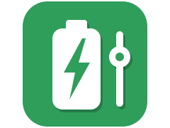
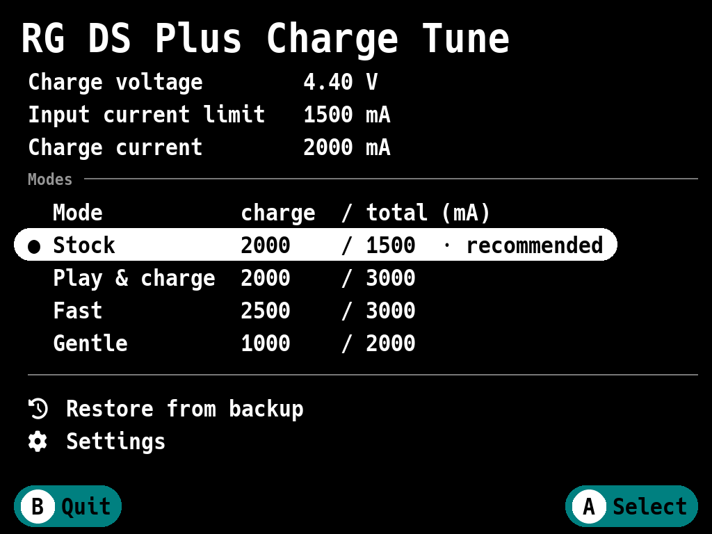
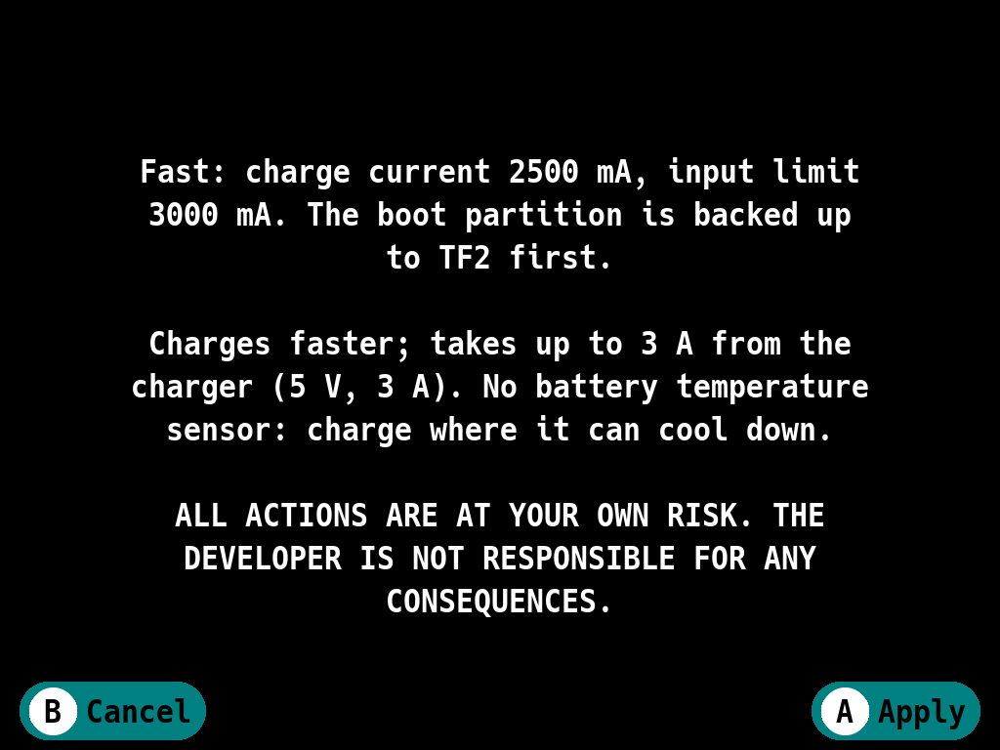
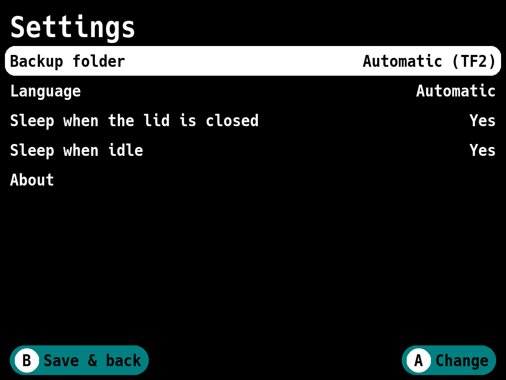

<p align="center"></p>

<h1 align="center">RG DS Plus Charge Tune</h1>

<p align="center">Choose how fast the Anbernic RG DS Plus charges, right on the console</p>

## Features

- **Four charging modes**: stock, play & charge (the stock battery current
  with a higher input limit), fast and gentle.
- **Shows the values in use**: charge voltage, input current limit and charge
  current the kernel booted with.
- **Backs up the boot partition** before the first change and after every
  firmware update, and **restores** any backup.
- **Checks everything before writing**: the model, the battery, the image and
  its checksums; afterwards it reads the partition back.
- **Asks before rebooting** when a change needs a reboot.
- **Sleeps when you close the lid** or after the console's sleep timer, never
  in the middle of a write.
- **8 languages**; follows the console's language and screen settings.

## How it works

The stock firmware's charger driver (RK817 PMIC) takes its limits from the
kernel device tree when the console starts, and nothing can change them
later.  
The device tree lives in the boot partition (`mmcblk1p3`), twice.  
The app changes `max_chrg_current` and `max_input_current` in both copies,
recomputes the checksums U-Boot verifies, and writes only the sectors that
changed.  
The charge voltage and everything else stay byte for byte.  
Details: [docs/how-it-works.md](docs/how-it-works.md).

## Disclaimer

**ALL ACTIONS ARE AT YOUR OWN RISK. THE DEVELOPER IS NOT RESPONSIBLE FOR ANY
CONSEQUENCES.**  
THE APP REWRITES THE CONSOLE'S BOOT PARTITION AND LETS THE BATTERY CHARGE FASTER THAN THE FACTORY SETTING.  
EVERY CONFIRMATION REPEATS THE FIRST TWO SENTENCES BEFORE ANYTHING IS WRITTEN, AND *SETTINGS → ABOUT* SHOWS THIS TEXT IN FULL; KEEP THE BACKUPS THE APP MAKES.

## Getting started

### Install

The app runs on the console's stock firmware (tested with 20260915).

1. Download `rgdsplus-charge-tune-<version>.zip` from the *Assets* of the latest
   release on the [Releases](https://github.com/Misaka0x2730/rgdsplus-charge-tune/releases)
   page.
2. Unzip it into the root of a memory card (usually TF2, the games card).  
   On macOS use Terminal, since double-clicking the archive
   puts everything into an extra folder (`NO NAME` is the card's name):
   ```sh
   unzip -o ~/Downloads/rgdsplus-charge-tune-v0.0.1.zip -d "/Volumes/NO NAME"
   diskutil eject "/Volumes/NO NAME"
   ```
3. Start **RG DS Plus Charge Tune** from *Applications* or *Ports*.

To update, unzip a newer release over the old one: settings are kept.  
To remove the app, delete from that card:

- `Ports/rgdsplus-charge-tune/`
- `Ports/RG DS Plus Charge Tune.sh`
- `Ports/Imgs/RG DS Plus Charge Tune.png`
- `Roms/APPS/RG DS Plus Charge Tune.sh`
- `Roms/APPS/Imgs/RG DS Plus Charge Tune.png`

Choose *Stock* or restore a backup first if you want the factory values back; the backups
are in `rgdsplus-charge-tune/backups/` on the card.

### Choose a mode



The top lines show the values in use.  
**●** marks the mode they belong to.  
Each mode row shows the charge current (into the battery) and the total
current the console may draw from the charger (the input limit), in mA.

| Mode | Charge current | Input current limit | For |
|---|---|---|---|
| Stock (recommended) | 2000 mA | 1500 mA | the factory values |
| Play & charge | 2000 mA | 3000 mA | the same battery current, but charging keeps up while you play |
| Fast | 2500 mA | 3000 mA | the fastest charge, most noticeable below half battery |
| Gentle | 1000 mA | 2000 mA | a slower, cooler charge that is easier on the battery |

1. Select a mode and press **A**.
2. Read the confirmation and press **A** again.



3. The app saves the boot partition if this firmware has no backup yet,
   writes the mode and checks it.
4. The new values take effect after a reboot: choose **Reboot** or **Later**.
   Until then the mode is marked *after a reboot*.

*Play & charge* and *Fast* take up to 3 A from the charger: use a 5 V charger rated for 3 A (most USB-C phone chargers). *Gentle* takes up to 2 A.  
From a computer's USB port the console takes at most 450 mA in every mode: the driver decides that, not the device tree.

### Restore a backup

*Restore from backup* lists the saved boot partitions with their date and
values.  
**A** writes one back (after saving the current partition if needed) and offers the reboot.  
A backup made on another firmware is marked: restoring it would also put that firmware's kernel back.

## Settings

Open **Settings** on the main screen; **B** saves and goes back.



| Setting | What it does |
|---|---|
| Backup folder | *Automatic* uses TF2, or TF1 without it; or pick a card's folder, or choose any folder on a card (the browser can create one, named `rgdsplus-charge-tune-backups` by default) |
| Language | *Automatic* follows the console, or pick a supported one |
| Sleep when the lid is closed | Sleeps 3 s after the lid closes, never while writing |
| Sleep when idle | Sleeps after the console's sleep timer with no button pressed |

While the app is open, the console's own sleep timer, lid and power button do
nothing; the two sleep settings above take over.

## Safety and recovery

Before writing, the app checks that it runs on an RG DS Plus, that the
battery has at least 20 % or the charger is connected, that the boot
partition is an unsigned image it understands with valid checksums, and that
the backup is on a memory card and reads back correctly.  
It writes only the few sectors that change and reads the whole partition back afterwards.  
If that does not match even after a second try, the app writes the previous content back and checks it; the error message says whether that worked and, if not, which backup to restore.

Backups are plain dumps of the 64 MB boot partition
(`boot-<date>-<sha>.img`, with a `.json` description next to it). Copy them to
a computer too.

If the console ever stops booting after a change, write a backup back from a
computer: take the system card (TF1) out and write the backup to its third
partition.

- macOS: find the card with `diskutil list` (say `disk4`), then
  ```sh
  diskutil unmountDisk /dev/disk4
  sudo dd if=boot-20261001-120000-eba3e65d.img of=/dev/rdisk4s3 bs=1m
  ```
- Linux: `sudo dd if=boot-….img of=/dev/sdX3 bs=1M conv=fsync` (`lsblk` shows
  the card).
- Windows has no built-in way to write a partition: use a Linux live USB, or
  flash the stock firmware image again.

## Limitations

- The charge voltage (4.40 V) is never changed.
- A firmware update replaces the boot partition: run the app again to choose
  a mode (it backs up the new firmware first).
- Signed boot images, or firmwares with another layout, are refused without
  changing anything.
- The battery has no temperature sensor in the device tree, so nothing slows
  charging when it gets warm: charge where the console can cool down.

## Reporting a problem

Open an issue at https://github.com/Misaka0x2730/rgdsplus-charge-tune/issues
with the version from *Settings → About* and the `.log` files from
`Ports/rgdsplus-charge-tune/data/`.  
Over SSH, `Ports/rgdsplus-charge-tune/rgdsplus-charge-tune -status` prints
what the app sees (it only reads); add its output too. For more detail, add
`export CHARGETUNE_DEBUG=1` to `data/launcher.env` and repeat the problem
first.

## Development

The app is written in Go on SDL2 (a fork of the
[gabagool](third_party/gabagool/FORK.md) UI library, shared with
[DSFetch](https://github.com/Misaka0x2730/dsfetch)) and built for the
console in an arm64 Docker image.

### Layout

```
cmd/rgdsplus-charge-tune  the app; -status and offline -patch-in/-patch-out
cmd/devseed               fake console for `task run` (./devroot)
cmd/mkicon                renders the menu icon from its SVG
internal/fdt              device tree reader with value offsets
internal/bootimg          FIT boot image and Rockchip resource image: parse, patch, rehash
internal/charger          modes, driver current steps, values of the running kernel
internal/flash            boot partition I/O, backups
internal/tune             apply a mode, restore a backup
internal/app              startup, screen router, input and sleep wiring
internal/ui               screens
internal/platform         device paths, modes, checks, lid and sleep
internal/store            settings
internal/i18n             UI translations
third_party/gabagool      the forked UI library
platforms/rgdsplus        launchers, Applications entry, icon
docker/, scripts/         arm64 build, license collection
```

The console's paths, the modes and the backup folders are in
`internal/platform/rgdsplus.json`; on a console, `data/platform.json`
overrides them without a rebuild (modes are still limited to 2500 mA charge
and 3000 mA input).

### Build and run

On macOS (Apple Silicon):

```sh
brew install go go-task sdl2 sdl2_image sdl2_ttf sdl2_gfx
task run                  # 1024x768 window on a fake console (./devroot);
                          # arrows, A/B/X/Y, Enter = Start, Space = Select, H = Menu
task devroot -- -boot 03_boot.img   # the fake console with a real boot dump
task test                 # unit tests
task test:stock STOCK_BOOT=03_boot.img   # checks against the stock 20260915 image
task icon                 # platforms/rgdsplus/icon.png from icon.svg
task package              # dist/rgdsplus-charge-tune-<version>.zip (needs Docker)
task deploy CONSOLE=<ip>  # install on the console over SSH (user root)
task status CONSOLE=<ip>  # what the app sees on the console
task logs CONSOLE=<ip>
```

`rgdsplus-charge-tune -patch-in boot.img -patch-out patched.img -mode fast`
patches a dump on a computer, for anyone who prefers to flash it themselves; it only writes regular files, never a partition or its own input.  
If cgo fails with `unknown architecture arm64e.x1` (Xcode older than the
Command Line Tools), set `DEVELOPER_DIR=/Library/Developer/CommandLineTools`;
the Taskfile already does.  
UI automation for screenshots is described in `internal/app/devtools.go`.

### Releases

Push a `v*` tag: CI (`.github/workflows/ci.yml`) tests, builds and publishes
a GitHub release with the zip; tags like `v1.1.0-rc1` become pre-releases.
*Settings → About* shows the version from `git describe`.  
In a private repository without arm64 runners, set the variable
`PACKAGE_RUNNER=ubuntu-24.04` (slower, under QEMU).

## License

MIT, see [LICENSE](LICENSE). Third-party components and their licenses are
listed in [THIRD_PARTY.md](THIRD_PARTY.md); the release zip carries their
full texts.
